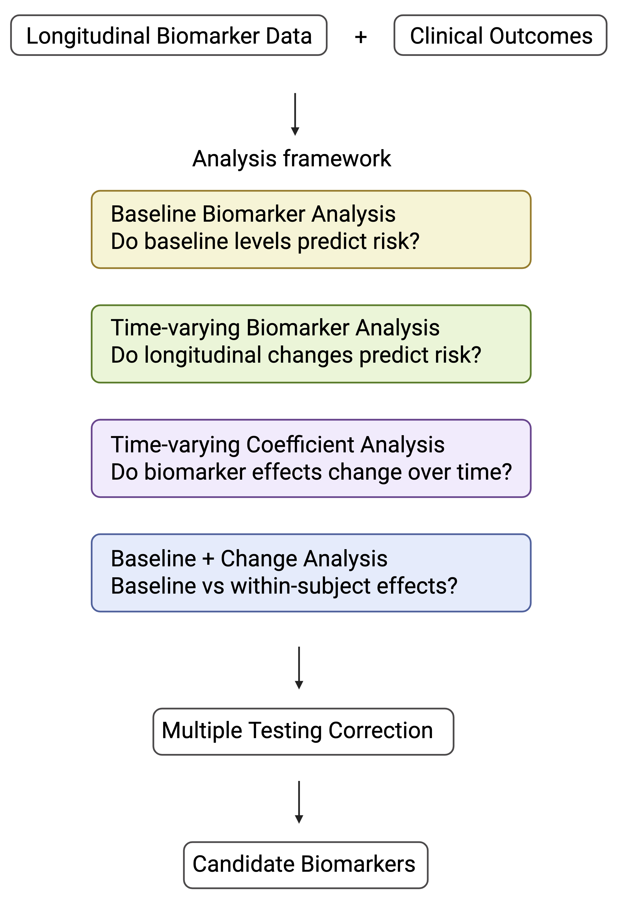

```{r setup, include=FALSE}
knitr::opts_chunk$set(collapse = TRUE,
  comment = "#>")
```
# survOmicsPkg

A reproducible framework for biomarker discovery in longitudinal omics studies.

survOmicsPkg is an R package designed to evaluate associations between molecular features and time-to-event outcomes in longitudinal studies. The package implements multiple survival modeling strategies commonly used in translational research, enabling investigators to distinguish prognostic biomarkers, dynamic disease processes, and time-dependent molecular effects within a unified analytical framework.

The framework was developed to support high-dimensional biomarker discovery workflows across transcriptomics, proteomics, metabolomics, microbiome, and clinical datasets.

## Scientific Motivation

Longitudinal biomedical studies frequently collect repeated molecular measurements together with clinical outcomes.

While standard survival analysis tools can fit individual Cox models, applying multiple modeling strategies consistently across large biomarker panels often requires substantial custom code.

survOmicsPkg was developed to provide a reproducible framework for evaluating distinct biological hypotheses, including:

- Whether baseline biomarker levels predict future outcomes
- Whether longitudinal biomarker changes are associated with risk
- Whether biomarker effects vary over time
- Whether risk is driven by baseline differences or within-subject changes

## Analysis Framework

The package supports four complementary survival modeling strategies commonly used in biomarker discovery and translational research:

| Analysis Type | Biological Question |
|--------------|---------------------|
| Baseline Biomarker | Do baseline molecular measurements predict future outcomes? |
| Time-Varying Biomarker | Are longitudinal biomarker changes associated with risk? |
| Time-Varying Coefficient | Does biomarker importance change over time? |
| Baseline + Change | Is risk driven by baseline differences or within-subject changes? |

These complementary modeling approaches allow investigators to evaluate distinct biological hypotheses that are often overlooked in traditional survival analyses. For example, a biomarker may predict risk at baseline but not change over time, while another biomarker may exhibit minimal baseline differences yet become informative through longitudinal changes.

## Workflow
<p align="center">
  
</p>

**Figure 1.** Overview of the survOmicsPkg analytical framework. The package supports four complementary survival modeling strategies for evaluating baseline, dynamic, time-dependent, and longitudinal biomarker effects.

## Example Applications

The analytical framework implemented in survOmicsPkg is applicable to:

- Blood transcriptomic studies
- Proteomic analyses
- Metabolomic studies
- Microbiome research
- Longitudinal immune profiling
- Biomarker discovery in translational medicine

The package was designed around common analytical challenges encountered in longitudinal multi-omics studies.


# Installation

```{r}
library("remotes")
remotes::install_github("lingdi-zhang/survOmicsPkg", force=TRUE)
library(survOmicsPkg)

```

## Quick Start Example Data

The package includes simulated longitudinal biomarker data demonstrating:

- Repeated biomarker measurements
- Time-to-event outcomes
- Multiple biomarker features

These datasets can be used to reproduce the examples below.


## Baseline Biomarker Analysis

Tests whether baseline biomarker levels are associated with future event risk.

```{r}

toy_metadata <- data.frame(
  id    = c(1,1,1,2,2,3,3,4,4,5),
  time  = c(0,2,6,0,2,0,2,0,4,0),
  event = c(0,0,1,0,1,0,0,0,1,0)
)

toy_baseline_biomarkers <- data.frame(
  id = c(1,2,3,4,5),
  biomarker1 = c(10.2,9.8,4.5,11.3,5.0),
  biomarker2 = c(2.1,2.5,8.5,1.8,7.9)
)

biomarkers=c("biomarker1","biomarker2")

```

```{r}
processed_data<-preprocess_data(
  metadata=toy_metadata,biomarkers=biomarkers,id_col="id",event_col="event",time_col="time",baseline_feature_table=toy_baseline_biomarkers,biomarker_type="baseline")

res<-run_multiple_cox_flexible(processed_data,biomarkers=biomarkers, event_col="event",time_col="time",biomarker_type="baseline")

outcomes=res[[1]]
terms=res[[2]]
FDR_res<-calculate_FDR(outcomes,terms)

head(FDR_res)

```

**Interpretation**

- HR > 1: higher baseline biomarker levels associated with increased risk
- HR < 1: higher baseline biomarker levels associated with decreased risk

Typical applications:

- Prognostic biomarker discovery
- Patient risk stratification
- Baseline disease prediction


## Time-Varying Biomarker Analysis

Tests whether biomarker values measured during follow-up are associated with event risk.

```{r}
toy_metadata <- data.frame(
  id    = c(1,1,1,2,2,3,3,3,4,4),
  time  = c(0,2,4,0,2,0,2,4,0,2),
  event = c(0,0,1,0,1,0,0,0,0,0)
)

toy_timevarying_biomarkers <- data.frame(
  id = c(1,1,1,2,2,3,3,3,4,4),
  time = c(0,2,4,0,2,0,2,4,0,2),

  biomarker1 = c(
    5,  8, 12,   
    4, 10,       
    3,  3,  2,   
    4,  4),

  biomarker2 = c(
    6,6,6,
    5,5,
    7,7,7,
    4,4)
)
biomarkers=c("biomarker1","biomarker2")

```

```{r}
processed_data<-preprocess_data(
  metadata=toy_metadata,biomarkers=biomarkers,id_col="id",event_col="event",time_col="time",start_col= 'start', stop_col='stop',time_varying_feature_table=toy_timevarying_biomarkers,biomarker_type="time_varying")

res<-run_multiple_cox_flexible(processed_data,biomarkers=biomarkers, event_col="event",start_col= 'start', stop_col='stop',biomarker_type="time_varying")

outcomes=res[[1]]
terms=res[[2]]
FDR_res<-calculate_FDR(outcomes,terms)

head(FDR_res)
```

**Interpretation**

- HR > 1: higher biomarker levels associated with increased risk
- HR < 1: higher biomarker levels associated with decreased risk


This approach incorporates longitudinal biomarker trajectories directly into the survival model.

Applications include:

- Dynamic disease monitoring
- Longitudinal immune profiling
- Treatment response biomarkers

## Time-Varying Coefficient Analysis

Tests whether biomarker effects change over time.

This model evaluates interactions between biomarker levels and follow-up time.

Applications include:

- Early versus late disease effects
- Treatment adaptation studies
- Temporal changes in biomarker importance

```{r}

processed_data<-preprocess_data(
  metadata=toy_metadata,biomarkers=biomarkers,id_col="id",event_col="event",time_col="time",baseline_feature_table=toy_baseline_biomarkers,biomarker_type="baseline")

res<-run_multiple_cox_flexible(processed_data,biomarkers=biomarkers, event_col="event",time_col="time",biomarker_type="baseline",time_varying_coefficients=TRUE,center_time=0)

outcomes=res[[1]]
terms=res[[2]]
FDR_res<-calculate_FDR(outcomes,terms)

head(FDR_res)

```

**Interpretation**

-biomarker*_bl: tests are between baseline biomarker levels and outcomes
-tt(biomarker*_bl): tests are between changes in relationships between baseline biomarker levels and outcomes

For biomarker*_bl:
- HR > 1: higher baseline biomarker levels associated with increased risk
- HR < 1: higher baseline biomarker levels associated with decreased risk

For tt(biomarker*_bl):
- HR > 1: impact of baseline biomarker levels on risk increase over time. 
- HR < 1: impact of baseline biomarker levels on risk decrease over time. 

**Note:** Time-varying coefficient models typically require larger sample sizes and more events than standard Cox models. The toy dataset is provided for demonstration purposes only, and some interaction terms may not be estimable. 

## Baseline + Change Model

Separates:

- Between-subject effects (baseline differences)
- Within-subject effects (longitudinal changes)

This decomposition helps determine whether event risk is driven by:

1. Persistent baseline differences between individuals
2. Dynamic biomarker changes within individuals over time

This framework is particularly useful for repeated-measurement studies.


```{r}

#Both the baseline biomarkers and time varying biomarkers are required in this model
processed_data<-preprocess_data(
  metadata=toy_metadata,biomarkers=biomarkers,id_col="id",event_col="event",time_col="time",start_col= 'start', stop_col='stop',baseline_feature_table=toy_baseline_biomarkers,time_varying_feature_table=toy_timevarying_biomarkers,biomarker_type="baseline_change")


res<-run_multiple_cox_flexible(processed_data,biomarkers=biomarkers, event_col="event",start_col= 'start', stop_col='stop',biomarker_type="baseline_change")

outcomes=res[[1]]
terms=res[[2]]
FDR_res<-calculate_FDR(outcomes,terms)

head(FDR_res)

```
**Interpretation**

- HR > 1: higher baseline biomarker levels or larger changes in biomarker levels associated with increased risk
- HR < 1: higher baseline biomarker levels or larger changes in biomarker levels associated with decreased risk

-biomarker*_bl: tests are between baseline biomarker levels and outcomes
-biomarker*_delta: tests are between changes in biomarker levels and outcomes


## Technical Design

Key design principles include:

- Modular implementation of multiple survival modeling strategies
- Consistent handling of longitudinal and time-to-event data
- Automated extraction of hazard ratios, confidence intervals, and significance statistics
- Support for high-throughput biomarker screening
- Reproducible workflows for large-scale omics analyses

## Repository Structure

```text

survOmicsPkg/
├── R/                    # Core package functions
├── man/                  # Function documentation
├── tests/                # Unit tests
├── man/figures/          # Workflow and documentation figures
├── README.Rmd
├── README.md
├── DESCRIPTION
├── NAMESPACE
├── LICENSE.md
└── LICENSE
```

## Project Significance

survOmicsPkg was developed to address analytical challenges commonly encountered in longitudinal multi-omics studies. By providing a unified framework for evaluating baseline, dynamic, and time-dependent biomarker effects, the package facilitates reproducible biomarker discovery and translational research workflows.

## Methods Implemented

The package currently supports:

- Cox proportional hazards models
- Time-varying covariate Cox models
- Time-varying coefficient models
- Baseline-versus-change decomposition
- Multiple-testing correction using FDR

Future development will focus on joint longitudinal-survival models and additional time-to-event methodologies.
